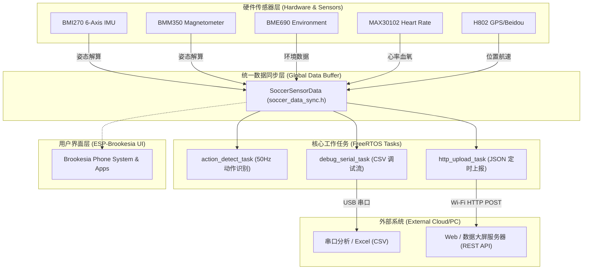

# ⚽ 智能足球训练助手 (Smart Soccer Trainer)

基于 **ESP32-C5**（ESP-SensairShuttle 平台）与 **ESP-Brookesia** 嵌入式图形系统的智能足球运动监测终端。集成了 9 轴姿态解算、动作识别（射门/传球）、GNSS 跑动轨迹追踪、生理体征监测（心率/血氧）、环境感知以及 Wi-Fi 智能数据上报等全套功能。

---

## 📖 目录

- [⚽ 智能足球训练助手 (Smart Soccer Trainer)](#-智能足球训练助手-smart-soccer-trainer)
  - [📖 目录](#-目录)
  - [🌟 核心特性](#-核心特性)
  - [🛠️ 硬件与传感器配置](#️-硬件与传感器配置)
  - [🏗️ 系统架构与设计哲学](#️-系统架构与设计哲学)
  - [📁 项目目录结构](#-项目目录结构)
  - [📡 通信协议与数据格式](#-通信协议与数据格式)
    - [1. HTTP JSON 上报协议](#1-http-json-上报协议)
    - [2. 串口 CSV 调试流](#2-串口-csv-调试流)
  - [🚀 快速开始与编译烧录](#-快速开始与编译烧录)
    - [1. 环境准备](#1-环境准备)
    - [2. Wi-Fi 与后端配置](#2-wi-fi-与后端配置)
    - [3. 编译与烧录](#3-编译与烧录)
  - [🎯 动作识别算法自定义](#-动作识别算法自定义)
  - [📄 开源许可证](#-开源许可证)

---

## 🌟 核心特性

- **⚽ 智能动作识别**：
  - 基于高频（50Hz / 20ms）采样，通过三轴加速度合矢量突变与三轴角速度特征，自动识别并统计 **射门（Shoot）** 与 **传球（Pass）** 动作。
  - 互补滤波融合 9 轴传感器，输出稳定的姿态角（俯仰角 Pitch、横滚角 Roll、航向角 Heading）。
- **📍 GNSS 轨迹与跑动里程追踪**：
  - 支持 H802 GPS + 北斗双模定位，实时获取经纬度、海拔、地面航速与航向。
  - 内置 **哈弗辛（Haversine）公式微积分算法**，过滤原地漂移与跳点，精准累加场上跑动总里程（米）。
  - *仿真回退机制*：未连接物理 GNSS 硬件时，内置自动足球场跑步轨迹仿真。
- **❤️ 生理体征监测与安全预警**：
  - 驱动 MAX30102 传感器采集实时心率（BPM）与血氧饱和度（SpO₂）。
  - 具备 **负荷过载预警**（心率 > 160 或 血氧 < 90% 触发告警标志位）。
  - *仿真回退机制*：支持心率平滑起伏仿真。
- **🌡️ 环境感知**：
  - 集成 BME690 + BSEC 算法，监测环境温度、相对湿度、大气压强以及空气质量指数（IAQ）。
- **📱 ESP-Brookesia 手机级 UI**：
  - 支持 ST77916 QSPI 显示屏与触控交互，内置温度、指南针、GNSS 与心率等多款独立 Brookesia App。
- **🛡️ 高可靠性容错设计（Fail-safe）**：
  - 核心数据采集与 UI 渲染解耦；即使未连接显示屏或 UI 初始化失败，底层传感器采集、串口调试与 HTTP 数据上报仍然正常工作。
- **📶 Wi-Fi 智能联网与极速调试**：
  - 启动后自动连接 Wi-Fi，支持 `AUTO` 关键字动态解析上位机/热点网关 IP，免去频繁更改代码中 IP 地址的烦恼。

---

## 🛠️ 硬件与传感器配置

| 模块类别 | 芯片/硬件型号 | 通信接口 | 功能描述 |
| :--- | :--- | :--- | :--- |
| **主控芯片** | **ESP32-C5** (ESP-SensairShuttle) | - | 2.4GHz / 5GHz Wi-Fi 6 + BLE 5 双频 RISC-V SoC |
| **运动传感器** | Bosch **BMI270** | I2C (SDA: GPIO 2, SCL: GPIO 3) | 6 轴加速度计 + 陀螺仪（用于动作检测与姿态解算） |
| **地磁传感器** | Bosch **BMM350** | I2C | 3 轴地磁罗盘（用于绝对航向角 Heading 修正） |
| **环境传感器** | Bosch **BME690** | I2C | 温湿度、气压、IAQ 空气质量指数 |
| **生理传感器** | Maxim **MAX30102** | I2C | 心率、血氧（PPG 光学监测） |
| **卫星定位** | **H802 GNSS** (GPS + 北斗) | UART | 经纬度、海拔、对地速度、卫星数 |
| **显示屏幕** | **ST77916** QSPI LCD | SPI (MOSI: GPIO 23, SCLK: GPIO 24) | 触控图形显示屏，呈现 Brookesia 系统 UI |

---

## 🏗️ 系统架构与设计哲学



> **设计哲学**：
> 1. **数据与 UI 彻底解耦**：所有传感器数据统一沉淀至全局紧凑结构体 `g_soccer_sensor_data`。
> 2. **硬件容错保活**：如果屏幕排线未接，主程序打印 Warning 并立即启动底层数据采集与网络上传，确保训练数据绝对不丢失。

---

## 📁 项目目录结构

```text
smart_soccer_trainer/
├── boards/
│   └── esp_SensairShuttle/         # ESP-SensairShuttle 板级配置文件 (GPIO/I2C/SPI 配置)
├── common_components/
│   ├── brookesia_app_compass/      # 指南针 / 9 轴运动姿态 App
│   ├── brookesia_app_gnss/         # GNSS 卫星定位 App
│   ├── brookesia_app_max30102/     # MAX30102 心率血氧监测 App
│   ├── brookesia_app_temperature/  # BME690 环境监测 App
│   ├── brookesia_system_core/      # ESP-Brookesia 核心组件
│   └── brookesia_system_phone/     # ESP-Brookesia 手机桌面与系统 UI
├── components/
│   └── gen_bmgr_codes/             # 板级管理生成组件
├── main/
│   ├── CMakeLists.txt
│   ├── idf_component.yml           # IDF 组件依赖
│   ├── main.cpp                    # 程序主入口与任务编排
│   ├── soccer_data_sync.h          # 统一传感器结构体定义 (SoccerSensorData)
│   ├── wifi_manager.h / .c         # Wi-Fi 连接管理与网关 IP 提取
│   └── http_uploader.h / .cpp      # 动作识别算法、距离积分、仿真、HTTP 上报
├── CMakeLists.txt
├── partitions.csv                  # 分区表配置
└── sdkconfig.defaults              # 默认工程配置
```

---

## 📡 通信协议与数据格式

### 1. HTTP JSON 上报协议

- **请求方式**：`POST`
- **默认路径**：`/api/device/upload`（默认周期：2000ms）
- **请求头**：`Content-Type: application/json`
- **请求体（Body）示例**：

```json
{
  "player_id": "player_001",
  "timestamp_ms": 1724467200000,
  "football_stats": {
    "shoot_count": 5,
    "pass_count": 28
  },
  "health_monitor": {
    "heart_rate": 138,
    "blood_oxygen": 98,
    "overload_warning": false
  },
  "gps_tracking": {
    "latitude": 39.9042160,
    "longitude": 116.4074280,
    "speed_kmh": 14.50,
    "total_distance_m": 1250.80
  }
}
```

### 2. 串口 CSV 调试流

系统在后台以标准 CSV 格式输出传感器原始数据，方便直接导入 Excel 或上位机做波形分析：

- **运动姿态（10ms 周期 / 100Hz）**：
  ```text
  时间戳(ms),加速度X,加速度Y,加速度Z,陀螺仪X,陀螺仪Y,陀螺仪Z,俯仰角Pitch,横滚角Roll,航向角Heading
  例如: 1250,0.120,-0.050,0.980,1.200,-0.800,0.100,2.1,-1.5,182.4
  ```
- **GNSS 定位（1000ms 周期）**：
  ```text
  时间戳(ms),GNSS,纬度,经度,海拔,对地速度,航向角,卫星数,定位质量
  例如: 1000,GNSS,39.9042160,116.4074280,45.2,12.5,90.0,12,1
  ```
- **心率血氧（1000ms 周期）**：
  ```text
  时间戳(ms),HR,心率(BPM),血氧(%)
  例如: 1000,HR,128,98
  ```
- **环境监测（3000ms 周期）**：
  ```text
  时间戳(ms),温度(℃),湿度(%),气压(Pa),IAQ空气质量
  例如: 3000,26.50,55.20,101325.0,25.0
  ```

---

## 🚀 快速开始与编译烧录

### 1. 环境准备

1. 安装 [ESP-IDF v5.1 及以上版本](https://docs.espressif.com/projects/esp-idf/zh_CN/latest/esp32c5/index.html)。
2. 设置编译目标芯片为 `esp32c5`：
   ```bash
   idf.py set-target esp32c5
   ```

### 2. Wi-Fi 与后端配置

打开 [main/main.cpp](file:///e:/esp_projects/smart_soccer_trainer/main/main.cpp)，修改您的 Wi-Fi 热点及后台接口配置：

```cpp
/* WiFi 热点配置 - 请修改为您手机热点或路由器的名称和密码 */
#define WIFI_SSID           "your_hotspot_ssid"
#define WIFI_PASSWORD       "your_hotspot_password"

/* 后端服务器上传接口地址 */
// 使用 "AUTO" 关键字时，开发板连上电脑热点会自动把 AUTO 替换为电脑的网关 IP
#define BACKEND_UPLOAD_URL  "http://AUTO:8000/api/device/upload"
```

### 3. 编译与烧录

连接开发板 USB，执行以下命令进行编译、烧录并打开串口监视器：

```bash
idf.py build flash monitor
```

---

## 🎯 动作识别算法自定义

动作检测算法位于 [main/http_uploader.cpp](file:///e:/esp_projects/smart_soccer_trainer/main/http_uploader.cpp) 的 `detect_football_action` 函数中。

您可根据训练护腿板或手环佩戴的实际物理位置，调整阈值与特征：
```cpp
// 1. 计算三轴加速度的合矢量幅值
float acc_mag = sqrt(acc_x * acc_x + acc_y * acc_y + acc_z * acc_z);

// 2. 判定阈值（合加速度突变 > 3.0g，间隔 > 1.5s）
if (acc_mag > 3.0f && (now_us - s_last_action_time_us) > 1500000) {
    // 3. 计算合角速度幅值
    float gyro_mag = sqrt(gyro_x*gyro_x + gyro_y*gyro_y + gyro_z*gyro_z);
    
    if (gyro_mag > 300.0f) {
        // 判定为射门
        s_shoot_count++;
    } else {
        // 判定为传球
        s_pass_count++;
    }
}
```

---

## 📄 开源许可证

本项目基于 [Apache License 2.0](LICENSE) 许可证开源。

